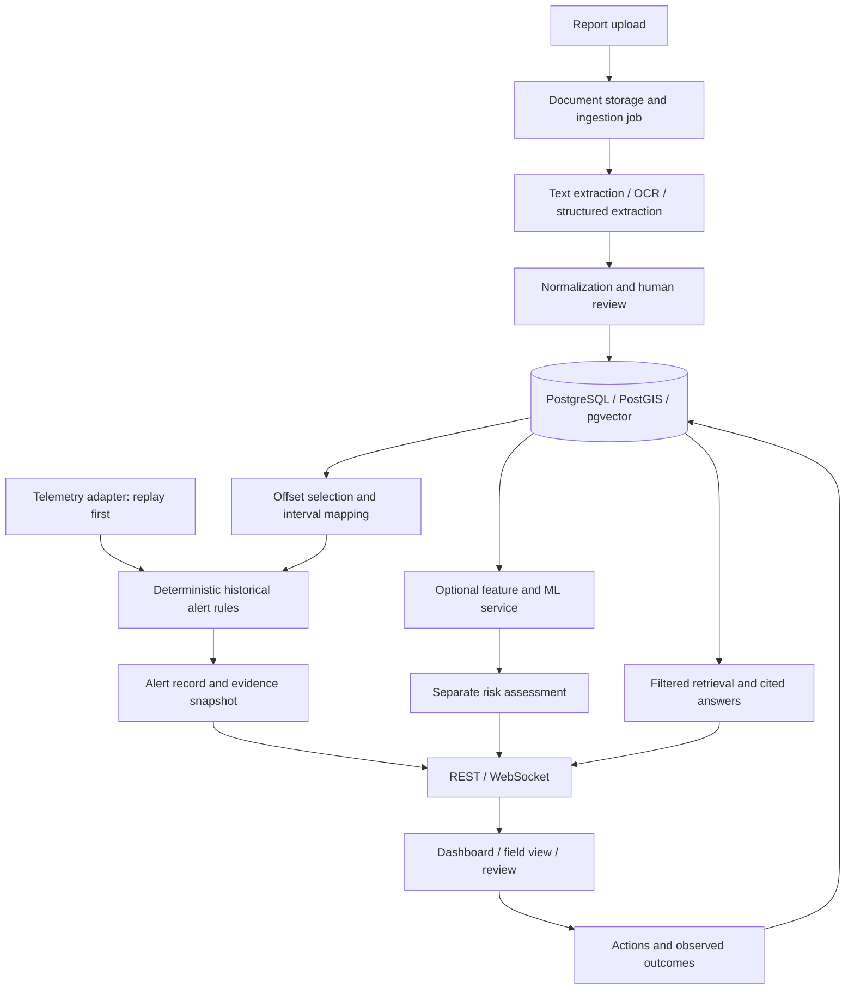

# Architecture and operating decisions

## Components

Use one PostgreSQL instance with PostGIS and pgvector; a FastAPI service; a separate ingestion worker; a React/TypeScript client; and document storage behind an adapter. Development storage can use a mounted local directory. REST serves records and actions; WebSocket streams replay state and alert updates.

There is no ML dependency on the alert firing path. Predicted risk without qualifying historical evidence is presented as a separate model signal in the baseline, not converted into a historical alert. Extending trigger types requires a recorded decision and tests.

## Ingestion

Persist upload checksum and job before returning HTTP 202. The worker extracts page text, applies OCR as needed, creates passages, requests schema-constrained extraction, validates units and references, and writes draft facts. A reviewer approves or corrects operational facts. Reprocessing creates a new extraction version; it does not overwrite the original evidence.

Use a PostgreSQL-backed jobs table initially, with transactional job claiming, attempt count, lease expiry and bounded retry. A worker crash can retry safely using idempotency keys. Separate embeddings and ingestion work from interactive requests. Store an embedding model identifier and dimension; the original draft's 1536 dimension is not a fixed requirement.

## Historical mapping algorithm v1

1. Select offset wells inside the requested surface radius in the same demo dataset/basin. Exclude the active well.
2. Resolve a basin-scoped formation identity and occurrence. Require approved top/base intervals and explicit, compatible depth references.
3. Convert survey-supported event and formation depths to a common TVD datum. Use source TVD values or interpolation between valid survey stations; do not extrapolate or assume MD equals TVD except in an explicitly vertical fixture.
4. Compute each historical event endpoint's fraction within its formation: `f = (event_tvd - offset_top_tvd) / (offset_base_tvd - offset_top_tvd)`.
5. Map to `active_top_tvd + f * (active_base_tvd - active_top_tvd)` and convert to active MD using the valid survey. Require a positive formation thickness and f in [0,1]. Ambiguous/non-monotonic inversion is unresolved.
6. Persist source/target intervals, version, uncertainties and transformation method with the evidence. This is a prototype alignment heuristic, not a geological equivalence claim.

Missing base, ambiguous repeated formations, incompatible datum, invalid survey, or uncertain identity returns `unresolved` with a reason. The engineer can still inspect the historical case; it cannot generate a precise depth alert until resolved. A reviewed explicit mapping can replace the heuristic with provenance. Formation names alone do not imply matching pressure or hazard conditions.

For the golden demo, wells are explicitly vertical with equal reference elevation, so MD = TVD. This simplification is labeled in the fixture and does not apply to public data automatically.

## Nearby versus analogous

Nearby uses geodesic surface distance. Analog ranking uses available geography, formation and trajectory evidence. Initial configurable weights: geography 0.3, geology 0.5, trajectory 0.2. Geography uses `max(0, 1 - distance / radius)`; geology is 1 for the approved target formation occurrence, 0 for a known mismatch. Unknown is null. Trajectory proximity is evaluated at the relevant interval, not only at total-depth bottom hole. Use the same radius-normalized distance function for that component.

Renormalize weights over available components and disclose which were absent. This score is a ranking heuristic, never a calibrated risk score. Deterministic alerts require a valid mapping and reviewed hazard event independently of ranking. Top-K controls display/retrieval; do not silently discard alert evidence merely because it fell below the display cutoff.

## Alert episode

For current MD d, mapped event interval [a,b] and lookahead L: the interval is relevant when `b >= d` and `a <= d + L`. Golden L is 100 m. Distance-to-start is `max(0,a-d)`. Rule matching is exact; mapping uncertainty is shown and is not hidden in a fabricated confidence percentage.

Persist one episode per `(replay_session, active_well, target_formation_interval, hazard_type, depth_band)`, where depth band is `floor(mapped_start_md / configured_band_m)`. Golden band is 50 m. Merge supporting events into the episode, retaining each mapped interval. Material changes to evidence or severity update its revision and notify; ordinary ticks only update last-seen/count. A unique database constraint enforces concurrent deduplication.

NEW → ACKNOWLEDGED → UNDER_REVIEW → RESOLVED, or NEW/ACKNOWLEDGED/UNDER_REVIEW → DISMISSED. Engineer/admin may change lifecycle; dismissal/resolution requires a reason. Passing the interval marks relevance `passed`, not outcome `safe`. Keep lifecycle and relevance separate. A resolved/dismissed episode remains deduplicated for that session; reopening requires an explicit audited action. New replay sessions can create new test episodes. Cooldown 300 s applies to ordinary repeat notifications, not first activation or material escalation.

Use event timestamps and sequence numbers for replay state; stale data is detected from last receipt time. Initial stale threshold: 15 s, configurable. Reconnection resumes via sequence cursor; out-of-order duplicates are ignored. Reset creates a new replay session with sequence 0 and does not mutate historical evidence.

## Trust and operations

Documents are untrusted content. Extraction and retrieval prompts treat embedded instructions as document text. Use validated filters and parameterized database queries. Verify that citations support the generated claim; merely attaching a citation is insufficient.

Local demo roles are viewer, engineer, reviewer, admin. Role enforcement is server-side. Record upload, correction, approval, alert action and configuration changes. External OCR/LLM processing is allowed for qualified public/synthetic inputs only; future private data requires a separately configured provider policy. Credentials stay in environment variables and must not enter logs.

Define adapters for telemetry, OCR, extraction, embeddings and document storage. Future eRTMAC integration must specify authentication, units, well identity, event time and freshness before activation. Phase 1 pins versions and validates the combined PostGIS/pgvector image. No cloud hosting is selected in Phase 0.
